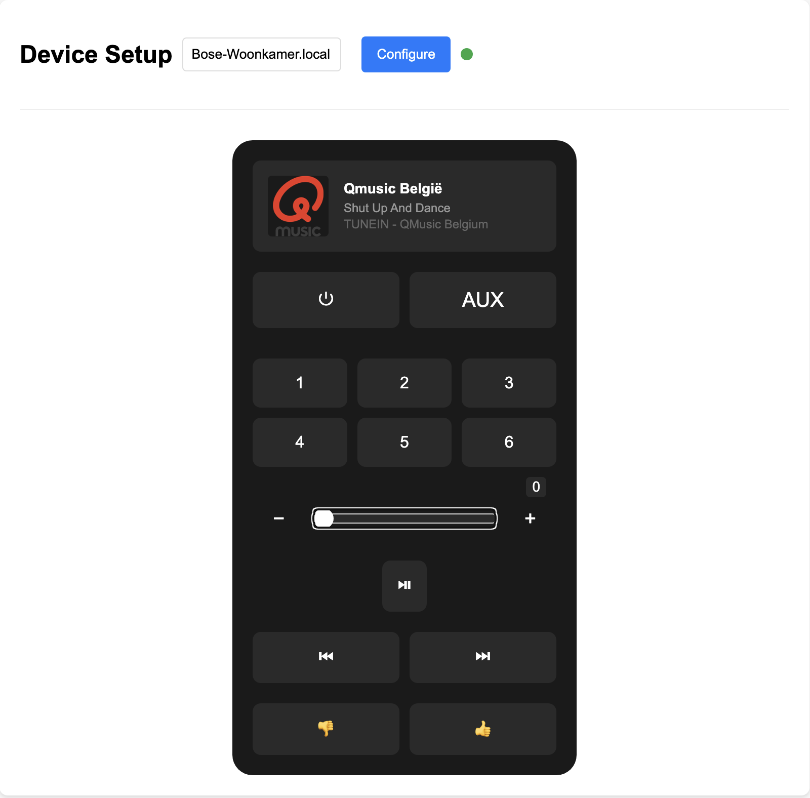

# Bose SoundTouch Control

This is a simple web interface for controlling a Bose SoundTouch speaker.
This application was built with the aid of [cursor.sh](https://cursor.sh) and [claude](https://claude.ai).

## Usage

1. Run `uv run fastapi dev` to start the API server.
2. Open `http://localhost:8000` in your web browser to control the speaker.

